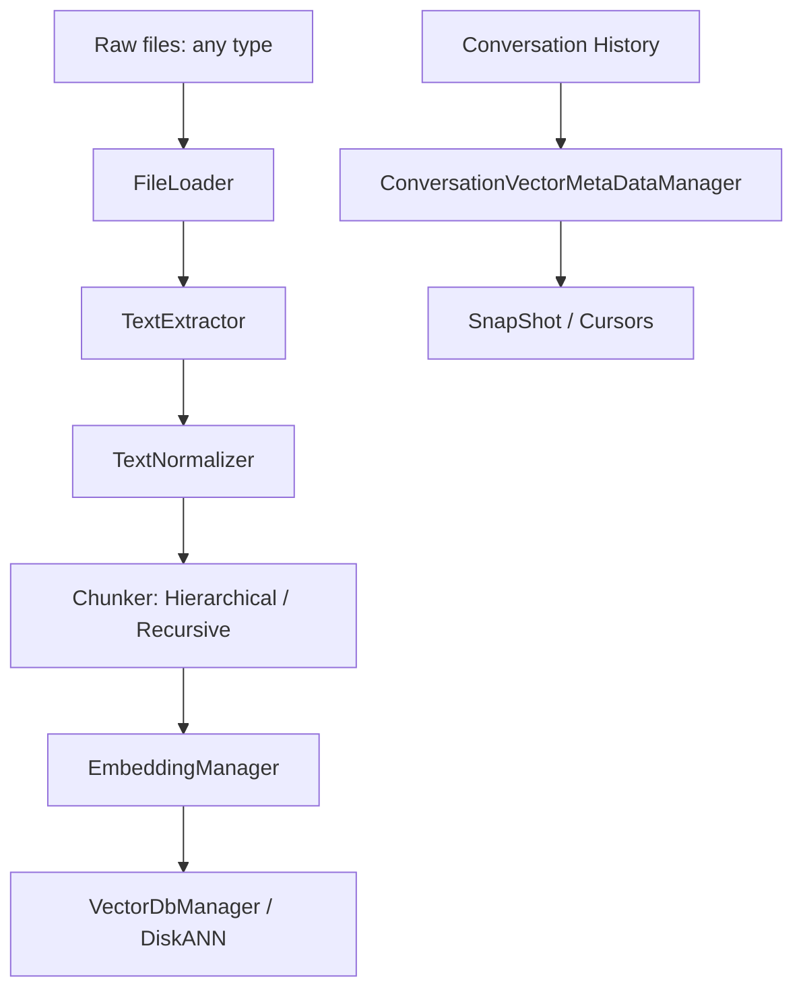

# Final Year Project Backend API Documentation

Welcome to the official API documentation for the **Final Year Project Backend Application**. This documentation suite provides detailed overviews, architectural workflows, class structures, parameter definitions, and public API descriptions for every module and submodule in the project.

## Table of Contents

### 1. Core Configuration & CLI Interface
- [Configuration (`config.py`)](config.md)
  - Centralized application settings (`Config`), and the re-exports that keep `from config import get_logger` working.
- [Logging (`logging_setup.py`)](logging.md)
  - `get_logger` for modules and `configure_logging` for the entry point, plus correlation context (`log_context`), stage timing (`log_timing`), rotation and JSON output.
- [Main Application Entrypoint (`main.py`)](main.md)
  - Startup initialization and execution mode orchestration.
- [Interactive CLI Interface (`cli_interface.py`)](cli_interface.md)
  - Command-line interaction session manager (`InteractiveCLI`).

### 2. Data Layer: Ingestion & Text Processing
- [Text File Processing (`FileLoader` & `TextExtractor`)](../data_layer_docs/text_file_processor.md)
  - Directory scanning and text extraction from any file type: dedicated readers for PDF, Office, HTML/XML, JSON and notebooks, with a decoded-text fallback for everything else.
- [Text Normalizer (`TextNormalizer` & `NormalizationProfiles`)](../data_layer_docs/normalizer.md)
  - Line-wise text cleaning that preserves paragraph structure, multi-shape heading detection (markdown, setext, numbered, ALL CAPS), and the `SectionSpan` offsets the chunker consumes.
- [Nodes & Metadata Structures (`nodes.py` & `metadata.py`)](../memory_layer_docs/nodes_and_metadata.md)
  - Immutable dataclasses representing documents, sections, contexts, chunks, normalized content, and vector embeddings along with their metadata.
- [Chunking Algorithms & DB Manager (`Chunker`)](../data_layer_docs/chunkers.md)
  - High-level orchestration (`Chunker`), section/paragraph-aware hierarchical chunking (`HierarchicalChunker`), separator-based recursive chunking (`RecursiveChunker`), word-boundary windowing (`windowing.sliding_windows`), and SQLite storage (`Manager`).
- [Embedding Manager (`EmbeddingManager`)](../data_layer_docs/embedding_manager.md)
  - Transformer-based vector encoding (`sentence-transformers`) for hierarchical and recursive chunks.
- [Unified Ingestion Pipeline (`IngestionPipeline`)](../data_layer_docs/ingestion_pipeline.md)
  - End-to-end interface wrapping file loading, extraction, normalization, chunking, embedding, and vector insertion.

### 3. Data Layer: Vector Database & Exceptions
- [Vector Database Management (`VectorDbManager` & `VectorDb_diskann`)](../data_layer_docs/vector_db_manager.md)
  - The DiskANN document index (`VectorDbManager`, `VectorDb_diskann`), the pgvector conversation store (`VectorRepository`), and the SQLite vector-metadata sidecar (`VectorMetaDataRepository`).
- [Data Layer Exceptions (`datalayer_exceptions.py`)](../data_layer_docs/datalayer_exceptions.md)
  - All twelve data-layer exceptions, their exact messages, and the known naming problems among them.

### 4. Memory & Conversation Pool Layer
- [Reading a Conversation (`Turn`)](../memory_layer_docs/conversation_turns.md)
  - Role-carrying readers on `FullConversationRepository`, `FullConversation` and `ConversationPoolManager`, the speaker-labelled transcript the summariser builds, and why batching never separates a turn from its speaker.
- [Conversation Vector Metadata Manager (`ConversationVectorMetaDataManager`)](../memory_layer_docs/conversation_vector_manager.md)
  - SQLite and memory-mapped vector management for conversational snapshots, summary vectors, and cumulative file offsets.
- [Conversational Snapshots (`SnapShot` & `SnapShotNode`)](../memory_layer_docs/snapshot.md)
  - Bidirectional cursor-based snapshot history tracker and cosine similarity search engine.
- [Topics (`TopicManager` & `TopicPoolMetaHandler`)](../memory_layer_docs/topic_manager.md)
  - Creating, reading and soft-deleting a topic; the `topics_mapping_table` schema and the locking the shared connection needs.
- [Project Registry (`ProjectMetaData`)](../memory_layer_docs/project_meta_data.md)
  - `project_table`, `project_description_table` and `project_mapping_table`, the summary text and its embedding, and the vectors-first write with a compensating delete.
- [Memory Pool Exceptions (`memory_pool_exceptions.py`)](../memory_layer_docs/memory_pool_exceptions.md)
  - Custom exceptions for cursor boundary errors, null pointers, and vector dimensionality validation.

---

## Architectural Workflow Overview

