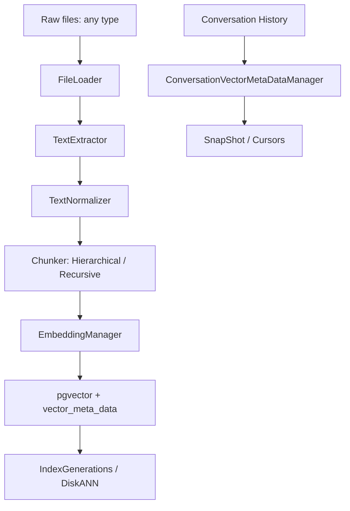

# Final Year Project Backend API Documentation

Welcome to the official API documentation for the **Final Year Project Backend Application**. This documentation suite provides detailed overviews, architectural workflows, class structures, parameter definitions, and public API descriptions for every module and submodule in the project.

## Table of Contents

### 1. Core Configuration & CLI Interface
- [Configuration (`config.py`)](config.md)
  - Centralized application settings (`Config`), and the re-exports that keep `from config import get_logger` working.
- [Logging (`logging_setup.py`)](logging.md)
  - `get_logger` for modules and `configure_logging` for the entry point, plus correlation context (`log_context`), stage timing (`log_timing`), rotation and JSON output.
- [Main Application Entrypoint (`main.py`)](main.md)
  - Startup initialization and execution mode orchestration.
- [Interactive CLI Interface (`cli_interface.py`)](cli_interface.md)
  - Command-line interaction session manager (`InteractiveCLI`).

### 2. Data Layer: Ingestion & Text Processing
- [Text File Processing (`FileLoader` & `TextExtractor`)](../data_layer_docs/text_file_processor.md)
  - Directory scanning and text extraction from any file type: dedicated readers for PDF, Office, HTML/XML, JSON and notebooks, with a decoded-text fallback for everything else.
- [Text Normalizer (`TextNormalizer` & `NormalizationProfiles`)](../data_layer_docs/normalizer.md)
  - Line-wise text cleaning that preserves paragraph structure, multi-shape heading detection (markdown, setext, numbered, ALL CAPS), and the `SectionSpan` offsets the chunker consumes.
- [Nodes & Metadata Structures (`nodes.py` & `metadata.py`)](../memory_layer_docs/nodes_and_metadata.md)
  - Immutable dataclasses representing documents, sections, contexts, chunks, normalized content, and vector embeddings along with their metadata.
- [Chunking Algorithms & DB Manager (`Chunker`)](../data_layer_docs/chunkers.md)
  - High-level orchestration (`Chunker`), section/paragraph-aware hierarchical chunking (`HierarchicalChunker`), separator-based recursive chunking (`RecursiveChunker`), word-boundary windowing (`windowing.sliding_windows`), and SQLite storage (`Manager`).
- [Embedding Manager (`EmbeddingManager`)](../data_layer_docs/embedding_manager.md)
  - Transformer-based vector encoding (`sentence-transformers`) for hierarchical and recursive chunks.
- [Unified Ingestion Pipeline (`IngestionPipeline`)](../data_layer_docs/ingestion_pipeline.md)
  - End-to-end interface wrapping file loading, extraction, normalization, chunking, embedding, and vector insertion.

### 3. Data Layer: Vector Database & Exceptions
- [Vector Database Management (`VectorDbManager` & `VectorDb_diskann`)](../data_layer_docs/vector_db_manager.md)
  - The pgvector store every vector lives in (`VectorRepository`), the label table that maps a DiskANN hit back to its chunk (`VectorMetaDataRepository`), the built index generations (`IndexGenerations`), the hybrid index searched over them (`VectorDbManager`), and the memory guard every allocation passes (`memory_guard`).
- [Data Layer Exceptions (`datalayer_exceptions.py`)](../data_layer_docs/datalayer_exceptions.md)
  - All eighteen data-layer exceptions, their exact messages, and the known naming problems among them.

### 4. Memory & Conversation Pool Layer
- [The Memory Database (`MemoryDatabase`)](../memory_layer_docs/memory_database.md)
  - The one SQLite file every memory table lives in: the shared connection, `writing()` with savepoints, `Schema` and the owners' creation order, the schema version, and the WAL / `synchronous=NORMAL` trade.
- [Reading a Conversation (`Turn`)](../memory_layer_docs/conversation_turns.md)
  - Role-carrying readers on `FullConversationRepository`, `FullConversation` and `ConversationPoolManager`, the speaker-labelled transcript the summariser builds, and why batching never separates a turn from its speaker.
- [Conversation Snapshot Metadata (`ConversationVectorMetaDataRepository`)](../memory_layer_docs/conversation_vector_manager.md)
  - The SQLite metadata for a conversation's snapshots, the per-project `seq`, the per-conversation watermark, and the pgvector proxy beside it.
- [Snapshot History (`SnapShot`)](../memory_layer_docs/snapshot.md)
  - Cursor-based navigation and cosine search over a conversation's or a project's snapshot history.
- [Project Snapshots (`ProjectSnapshot` & `ProjectSnapshotRepository`)](../memory_layer_docs/project_snapshot.md)
  - A project's incremental rolling description and the append-only chain that stores it.
- [Topics (`TopicManager` & `TopicPoolMetaHandler`)](../memory_layer_docs/topic_manager.md)
  - Creating, reading and soft-deleting a topic, and the `topics_mapping_table` schema.
- [Project Registry (`ProjectMetaData`)](../memory_layer_docs/project_meta_data.md)
  - `project_table`, `project_description_table` and `project_mapping_table`, the foreign keys that keep a project's topic consistent, and the vectors-first write with a compensating delete.
- [Conversation Mapping (`MemoryMappingHandler`)](../memory_layer_docs/memory_mapping_handler.md)
  - Which topic and project a conversation was routed to, and its project's latest snapshot, read from the chain.
- [Identifiers (`require_identifier`)](../memory_layer_docs/identifiers.md)
  - The validation every id that scopes a row goes through, and where it is applied.
- [Memory Pool Exceptions (`memory_pool_exceptions.py`)](../memory_layer_docs/memory_pool_exceptions.md)
  - Cursor and dimension errors, and the named refusals for a foreign key the memory database rejects.

---

## Architectural Workflow Overview

```mermaid
graph TD
    A[Raw files: any type] --> B[FileLoader]
    B --> C[TextExtractor]
    C --> D[TextNormalizer]
    D --> E[Chunker: Hierarchical / Recursive]
    E --> F[EmbeddingManager]
    F --> P[pgvector + vector_meta_data]
    P --> G[IndexGenerations / DiskANN]
    
    H[Conversation History] --> I[ConversationVectorMetaDataManager]
    I --> J[SnapShot / Cursors]
```
